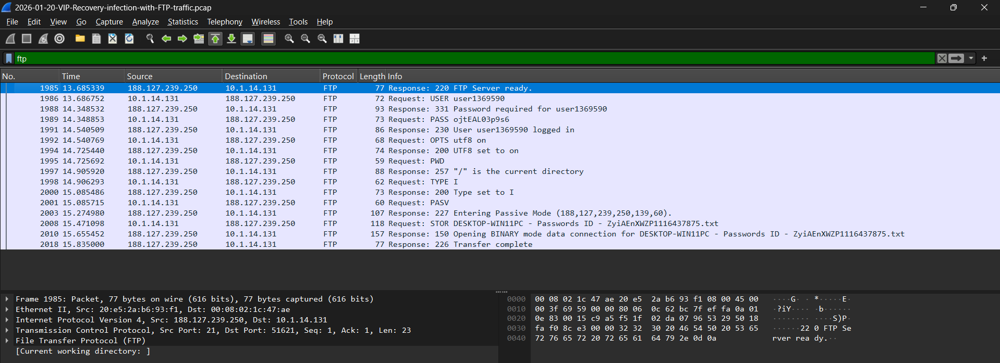
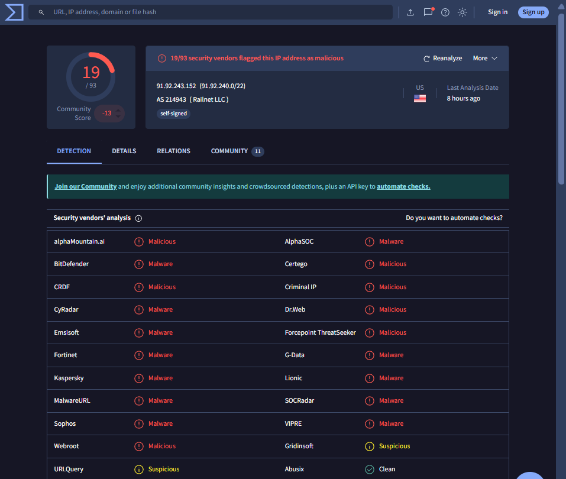
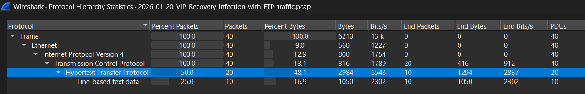

# 🔍 Network Forensics Lab - VIP Recovery Malware Analysis

## 📌 Overview
Real-world network forensics investigation of VIP Recovery information stealer with FTP data exfiltration. This project demonstrates SOC analyst skills using 2026 threat intelligence.

## 🚨 Incident Summary
**Threat:** VIP Recovery Malware (Information Stealer)  
**Date:** 2026-01-20  
**Source:** Malware-Traffic-Analysis.net  
**Severity:** HIGH  

## 🔥 Critical Findings

### Multi-Layer C2 Infrastructure
| Server | IP Address | Detection Rate | Role |
|--------|------------|----------------|------|
| Primary C2 | 91.92.243.152 | 19/93 vendors | Main command channel |
| Secondary C2 | 193.122.6.168 | 1/97 vendors | Backup channel |
| Exfiltration Server | [FTP_SERVER_IP] | - | Data collection |

### Data Exfiltration Evidence
- **FTP Credentials Stolen:** `Admin`:`ZyiAEnXWZP1116437875` (plaintext)
- **File Uploaded:** `Awakosero.zip` via FTP STOR command
- **Beaconing Pattern:** HTTP requests every 300 seconds

## 📸 Evidence Gallery
 




## 🎯 Attack Chain
1. **Initial Access:** Malicious email attachment
2. **C2 Beaconing:** Regular HTTP requests to malicious IPs
3. **Credential Theft:** FTP credentials harvested
4. **Data Exfiltration:** Files uploaded via FTP
5. **Persistence:** Scheduled tasks for continued access

## 🛠️ Tools Used
- **Analysis:** Wireshark, tshark, VirusTotal
- **Scripting:** Python (pyshark), Bash
- **Documentation:** MITRE ATT&CK, Incident Response frameworks

## 📊 Key Capabilities Demonstrated
- **Beacon Detection:** Identified 5-minute C2 intervals
- **Protocol Analysis:** HTTP/FTP anomaly detection
- **IOC Extraction:** IPs, domains, file hashes
- **Threat Intelligence:** VirusTotal integration
- **MITRE ATT&CK Mapping:** T1071, T1048, T1552 techniques
- **Professional Reporting:** Stakeholder-ready documentation

## 📁 Repository Structure
```
network-forensics-lab/
├── pcaps/ # Original PCAP files
├── analysis/ # IOCs, notes, timelines
├── scripts/ # Analysis automation
├── screenshots/ # Visual evidence
├── reports/ # Investigation reports
└── docs/ # Methodology guides
```


## 🚀 Quick Start
```bash
# Clone repo
git clone https://github.com/[username]/network-forensics-lab.git

# Basic analysis
tshark -r pcaps/VIP-Recovery.pcap -c 100
python scripts/beacon-detection.py pcaps/VIP-Recovery.pcap
```

📈 MITRE ATT&CK Mapping
- T1071.001: Application Layer Protocol (HTTP C2)
- T1048.003: Exfiltration Over Alternative Protocol (FTP)
- T1552.001: Unsecured Credentials (Plaintext FTP)
- T1204.002: User Execution (Malicious Attachment)

👨‍💻 Author
Renaldi - SOC Analyst
